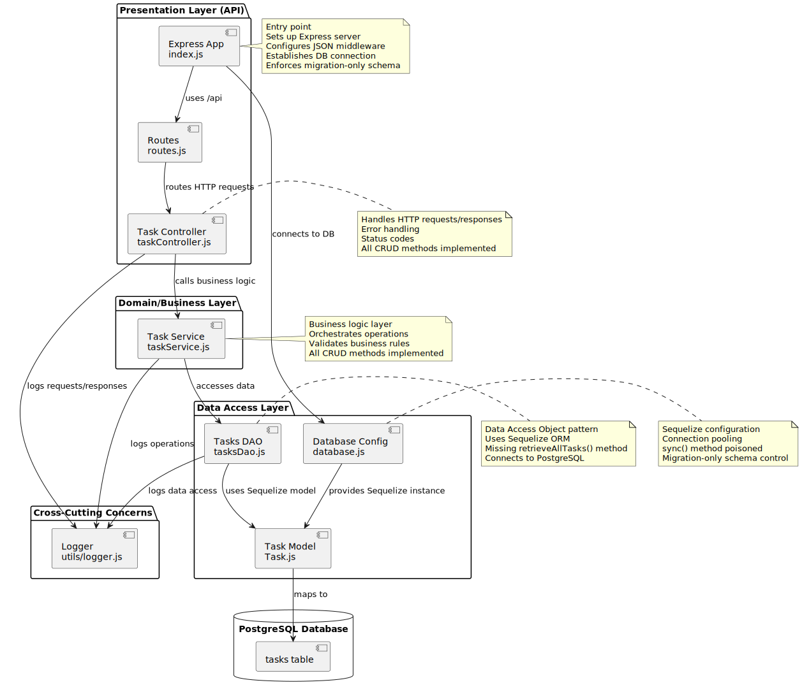

# Codebase Architecture Analysis

## Overview
This is a Node.js Express API server implementing a **Layered Architecture** (also known as N-Tier Architecture) pattern with clear separation of concerns.

## Architecture Overview Diagram



*High-level view of the layered architecture showing all components and their relationships*

## Architecture Pattern: Layered Architecture

The codebase follows a **3-layer architecture** with an additional cross-cutting concern layer:

### 1. Presentation Layer (API Layer)
**Location**: `src/api/`

**Components**:
- **Routes** (`routes.js`): Defines HTTP endpoints and maps them to controller functions
- **Controllers** (`taskController.js`): Handles HTTP requests/responses, error handling, and status codes

**Responsibilities**:
- ✅ Receive HTTP requests
- ✅ Validate request format
- ✅ Call business logic layer
- ✅ Format HTTP responses
- ✅ Handle HTTP-specific concerns (status codes, headers)

### 2. Domain/Business Layer
**Location**: `src/domain/`

**Components**:
- **Task Service** (`taskService.js`): Contains business logic and orchestrates operations

**Responsibilities**:
- ✅ Implement business rules
- ✅ Orchestrate data operations
- ✅ Validate business constraints
- ✅ Coordinate between multiple data sources (if needed)

### 3. Data Access Layer
**Location**: `src/data/models/`

**Components**:
- **Tasks DAO** (`tasksDao.js`): Data Access Object pattern implementation
- **Task Model** (`Task.js`): Sequelize ORM model definition
- **Database Config** (`database.js`): Sequelize runtime configuration

**Responsibilities**:
- ✅ Abstract data persistence details
- ✅ Provide data access methods
- ✅ Uses Sequelize ORM with PostgreSQL database
- ✅ Implements CRUD operations via Sequelize models

### 4. Cross-Cutting Concerns
**Location**: `src/utils/`

**Components**:
- **Logger** (`logger.js`): Centralized logging utility using Winston

**Responsibilities**:
- ✅ Logging across all layers
- ✅ Error tracking
- ✅ Request/response logging
- ✅ File-based logging (error.log, combined.log)
- ✅ Console logging in non-production environments

## Design Patterns Identified

### 1. **Layered Architecture Pattern** 🏗️
Clear separation into presentation, business, and data layers with unidirectional dependencies. This pattern ensures that each layer has a single responsibility and dependencies flow in one direction only.

### 2. **DAO (Data Access Object) Pattern** 📦
`tasksDao.js` abstracts data access, allowing easy replacement of data sources without changing business logic. This provides flexibility to switch between different data storage solutions.

### 3. **Service Layer Pattern** ⚙️
`taskService.js` encapsulates business logic separate from HTTP concerns. This separation allows business rules to be tested and reused independently of the presentation layer.

### 4. **Dependency Injection** 💉
Components depend on abstractions (services depend on DAOs, controllers depend on services). This promotes loose coupling and makes the system more testable and maintainable.

## Request Flow

### Sequence Diagram


*Complete sequence diagram showing application startup, database connection, and request handling flow*

### Text Flow Summary

```
HTTP Request
    ↓
Express App (index.js)
    ↓
[Database connection established]
    ↓
Routes (routes.js)
    ↓
Controller (taskController.js)
    ↓
Service (taskService.js)
    ↓
DAO (tasksDao.js)
    ↓
Sequelize ORM
    ↓
PostgreSQL Database
    ↓
[Response flows back up]
```

## Component Relationships

### Class Diagram


*Detailed class diagram showing all components, their methods, relationships, and dependencies*

## Key Components

### Entry Point: `index.js`
- Initializes Express application
- Configures JSON middleware
- Establishes database connection via Sequelize
- Verifies database connection before starting server
- Enforces migration-only schema control (sync() is poisoned)
- Registers routes
- Starts HTTP server

### Routes: `routes.js`
- Defines RESTful endpoints
- Maps HTTP methods to controller functions
- Currently only `GET /api/tasks` is active

### Controller: `taskController.js`
- Handles HTTP request/response cycle
- Implements error handling
- Uses logger for request tracking
- Returns appropriate HTTP status codes

### Service: `taskService.js`
- Contains business logic
- Orchestrates data operations
- Handles business-level errors
- Implements all CRUD methods: `listTasks()`, `createTask()`, `updateTasks()`, `deleteTasks()`
- Validates business rules (e.g., task title required)
- Logs errors before re-throwing

### DAO: `tasksDao.js`
- Provides data access abstraction
- Uses Sequelize ORM to interact with PostgreSQL database
- Implements: `retrieveTaskById()`, `createTask()`, `updateTask()`, `deleteTask()`
- **Note**: `retrieveAllTasks()` method is missing but called by `taskService.listTasks()` - this is a bug
- Returns JSON-serialized task objects

### Logger: `logger.js`
- Winston-based logging
- File-based logging (error.log, combined.log) in `../logs/` directory
- Console logging in non-production environments
- JSON format for structured logging
- Timestamp format: DD-MM-YYYY HH:mm:ss

### Database: `database.js` & `config/database.js`
- Sequelize ORM configuration
- PostgreSQL database connection
- Connection pooling configured (max: 5, min: 0)
- Environment-based configuration via `.env` file
- **Critical**: `sync()` method is intentionally poisoned to prevent runtime schema mutations
- Schema changes must use migrations via sequelize-cli

### Task Model: `Task.js`
- Sequelize model definition
- Fields: `id` (auto-increment), `title` (required, 1-255 chars), `description` (optional), `completed` (boolean, default false), `createdAt`, `updatedAt`
- Table name: `tasks`
- Timestamps enabled

## Current State

### ✅ Active Features
- **GET /api/tasks** - List all tasks (route active, but `retrieveAllTasks()` function missing in DAO)
- **Database connection** - Via Sequelize ORM with PostgreSQL
- **PostgreSQL integration** - Fully configured with connection pooling
- **Error handling** - Comprehensive error handling and logging
- **Layered architecture** - Clean separation of concerns implemented
- **Migration-only schema control** - `sync()` method poisoned to enforce migrations

### ⏸️ Commented/Inactive Routes
The following routes are commented out but have full implementation in controller/service/DAO layers:
- **POST /api/tasks** - Create task
- **PATCH /api/tasks/:id** - Update task
- **DELETE /api/tasks/:id** - Delete task

### ⚠️ Known Issues

| Issue | Severity | Description |
|-------|----------|-------------|
| Missing `retrieveAllTasks()` | 🔴 High | `taskService.listTasks()` calls `tasksDao.retrieveAllTasks()` which doesn't exist |
| Incomplete error handling | 🟡 Medium | `createTask`, `updateTasks`, and `deleteTasks` controllers don't send error responses (only log errors) |

## Dependencies

### Runtime Dependencies
| Package | Version | Purpose |
|---------|---------|---------|
| **express** | ^5.2.1 | Web framework |
| **winston** | ^3.19.0 | Logging library |
| **sequelize** | ^6.37.7 | ORM for database operations |
| **pg** | ^8.16.3 | PostgreSQL client |
| **pg-hstore** | ^2.3.4 | PostgreSQL hstore support |
| **dotenv** | ^17.2.3 | Environment variable management |

### Development Dependencies
| Package | Version | Purpose |
|---------|---------|---------|
| **nodemon** | ^3.1.11 | Development server with auto-reload |
| **sequelize-cli** | ^6.6.5 | CLI for migrations |

## Strengths 💪

1. ✅ **Clear separation of concerns** - Each layer has a well-defined responsibility
2. ✅ **Easy to test** - Each layer can be tested independently with mock dependencies
3. ✅ **Scalable architecture** - Can easily add new features or modify existing ones
4. ✅ **Maintainable code structure** - Well-organized and follows established patterns
5. ✅ **Centralized logging** - Consistent logging across all layers using Winston
6. ✅ **Database abstraction** - Sequelize ORM provides database independence
7. ✅ **Migration-based schema control** - Prevents accidental schema changes in production

## Recommendations 🎯

### Critical (Must Fix)
1. 🔴 **Fix missing function**: Implement `retrieveAllTasks()` in `tasksDao.js` using `Task.findAll()`
2. 🔴 **Fix error handling**: Add proper error responses in `createTask`, `updateTasks`, and `deleteTasks` controllers

### High Priority
3. 🟠 **Complete CRUD operations**: Uncomment remaining route endpoints (code is already implemented)
4. 🟠 **Add database migrations**: Create initial migration for tasks table
5. 🟠 **Add error handling middleware**: Centralize error handling for consistency

### Medium Priority
6. 🟡 **Add validation**: Implement request validation middleware (e.g., express-validator)
7. 🟡 **Add database seeders**: Create seed data for development/testing
8. 🟡 **Add tests**: Unit tests for each layer (Jest/Mocha recommended)

### Nice to Have
9. 🟢 **Add API documentation**: Consider Swagger/OpenAPI for interactive API docs
10. 🟢 **Add request rate limiting**: Protect against abuse
11. 🟢 **Add health check endpoint**: Monitor application status
12. 🟢 **Add CORS configuration**: If frontend will be separate

## Visual Documentation

This architecture analysis includes three comprehensive diagrams:

1. **[Architecture Overview Diagram](architecture-diagram_v1.svg)** - High-level component diagram showing layers and their relationships
2. **[Class Diagram](class-diagram_v1.svg)** - Detailed class relationships, methods, and dependencies
3. **[Sequence Diagram](sequence-diagram_v1.svg)** - Complete request flow from client to database and back

All diagrams are available in SVG format for high-quality rendering and can be viewed directly in markdown viewers or browsers.
